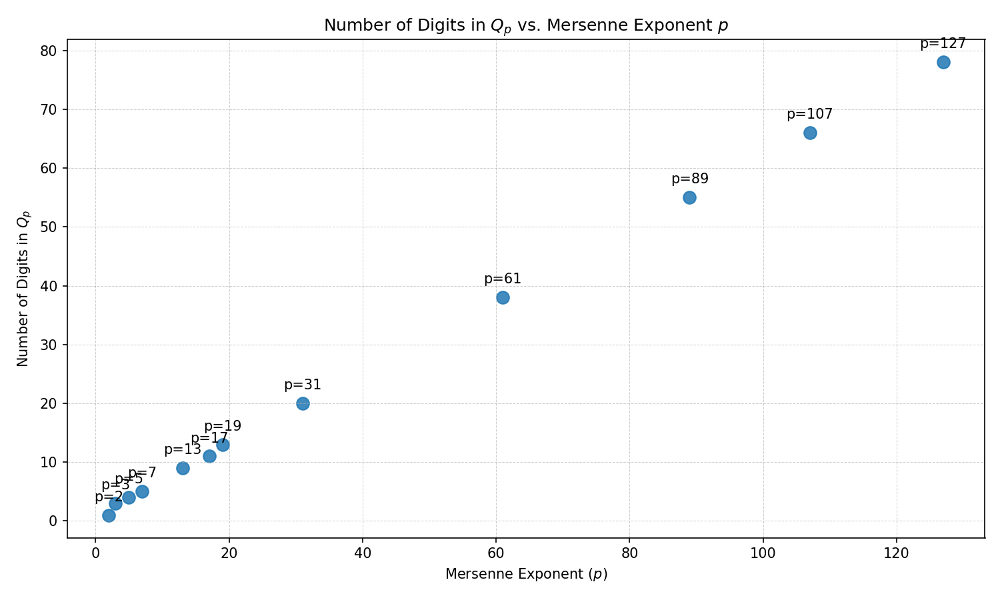

# Q_p Summary (generated 2025-08-23T21:45:45.353259+00:00)

## Plots

## Detailed Analysis Table

| p | p_mod_4 | forced_by_5 | killed_by_7 | killed_by_11 | killers | Qp_mod_5 | Qp_digits | Qp_probably_prime |
|---|---|---|---|---|---|---|---|---|
| 2 | 2 | False | False | False | - | 0 | 1 | True |
| 3 | 3 | False | False | False | - | 1 | 3 | True |
| 5 | 1 | True | False | False | 5 | 0 | 4 | False |
| 7 | 3 | False | False | False | - | 1 | 5 | True |
| 13 | 1 | True | False | False | 5 | 0 | 9 | False |
| 17 | 1 | True | False | False | 5 | 0 | 11 | False |
| 19 | 3 | False | False | False | - | 1 | 13 | False |
| 31 | 3 | False | False | False | - | 1 | 20 | False |
| 61 | 1 | True | False | False | 5 | 0 | 38 | False |
| 89 | 1 | True | False | False | 5 | 0 | 55 | False |
| 107 | 3 | False | False | False | - | 1 | 66 | False |
| 127 | 3 | False | False | False | - | 1 | 78 | False |

---

## Small-case factorizations (p=5,13,17)

- p=5: Q_p=3365 = 5 * 673  (forced_by_5=True, Qp_probably_prime=False)
- p=13: Q_p=268238885 = 5 * 53647777  (forced_by_5=True, Qp_probably_prime=False)
- p=17: Q_p=68716331045 = 5 * 13743266209  (forced_by_5=True, Qp_probably_prime=False)
