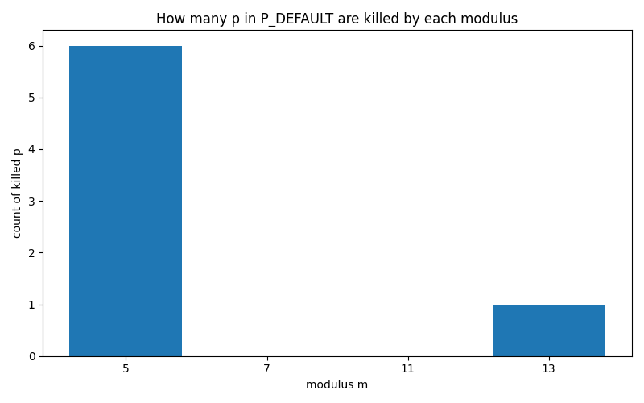

# Residue Classes for Small Moduli

## mod 5
- period: **4**
- residues r where Q_p ≡ 0 (mod 5): **[1, 2]**

## mod 7
- period: **3**
- residues r where Q_p ≡ 0 (mod 7): **[]**

## mod 11
- period: **10**
- residues r where Q_p ≡ 0 (mod 11): **[]**

## mod 13
- period: **12**
- residues r where Q_p ≡ 0 (mod 13): **[6, 11]**

